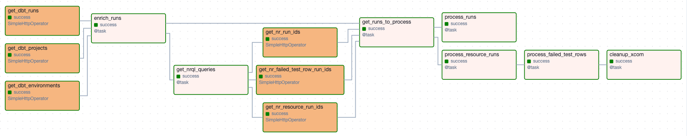

<a href="https://opensource.newrelic.com/oss-category/#new-relic-experimental"><picture><source media="(prefers-color-scheme: dark)" srcset="https://github.com/newrelic/opensource-website/raw/main/src/images/categories/dark/Experimental.png"><source media="(prefers-color-scheme: light)" srcset="https://github.com/newrelic/opensource-website/raw/main/src/images/categories/Experimental.png"></picture></a>

# New Relic Dbt Cloud Integration
An Airflow-based New Relic integration for dbt Cloud running with Snowflake. Collects metadata about dbt Cloud runs, resource runs, and failed test rows. 


## Airflow DAG Installation/Configuration

### Prerequisites
* Dbt Cloud account with APIs enabled using Snowflake to run resources and tests
* Snowflake account where the dbt Cloud account runs on
* Existing Airflow environment >= 2.8.1 or ability to run docker compose
* New Relic account

**Existing Airflow Environment:**
* Ensure you have dbt Cloud and Snowflake Airflow providers
* `pip install apache-airflow-providers-snowflake==3.0.0` 
* `pip install apache-airflow-providers-dbt-cloud==3`
* Copy the contents of airflow/dags/ to the root of your dags folder
* Create the five connections below
* Enable the new_relic_data_pipeline_observability_get_dbt_run_metadata2 DAG
* The default schedule will run every 10 minutes and send data to NR1 

**Docker Compose:** Please note, this docker-compose.yml is a slightly-modified version of the default Airflow file. It
is not intended for production use. 
* Run `docker-compose up airflow-init'
* Run `docker-compose up'
* Create the five connections below
* Enable the new_relic_data_pipeline_observability_get_dbt_run_metadata2 DAG
* The default schedule will run every 10 minutes and send data to NR1 

### Connections
This DAG requires five connections. Two for dbt Cloud, two for New Relic, and one for Snowflake. 

**dbt_cloud_admin_api:** Allows us to connect to the dbt cloud admin api with SimpleHttpHook
* Type: http
* Host: https://cloud.getdbt.com/api/v2/accounts/ACCOUNT_ID/ (Replace ACCOUNT_ID with your dbt Cloud account id)
* Password: Your [dbt cloud api token (Profile settings) or a service account token](https://docs.getdbt.com/docs/dbt-cloud-apis/user-tokens#user-tokens)

**dbt_cloud_discovery_api:** Allows us to connect to the dbt discovery API
* Type: http
* Host: https://metadata.cloud.getdbt.com/graphql
* Password: [Dbt cloud service account token](https://docs.getdbt.com/docs/dbt-cloud-apis/user-tokens#user-tokens)

**nr_insights_insert:** Allows us to upload custom events to NR1
* Type: http
* Host: https://insights-collector.newrelic.com/v1/accounts/ACCOUNT_ID/events (Replace ACCOUNT_ID with your account id) 
* Password: Your [NR Insights Insert API Key](https://one.newrelic.com/admin-portal/api-keys/insightkeys) 

**nr_insights_query:** Allows us to query NR1 custom events
* Type: http
* Host: https://insights-api.newrelic.com/v1/accounts/ACCOUNT_ID/query (Replace ACCOUNT_ID with your account id) 
* Password: Your [NR Insights Query API Key](https://one.newrelic.com/admin-portal/api-keys/insightkeys) 

**SNOWFLAKE:** Allows us to query snowflake for failed test rows. There are [many ways](https://airflow.apache.org/docs/apache-airflow-providers-snowflake/stable/connections/snowflake.html) to configure a snowflake connection. 
To configure using a private key pair, fill in the following attributes. 
* Type: Snowflake
* Login: Your Snowflake username
* Account: Your Snowflake account 
* Warehouse: Your Snowflake warehouse 
* Role: Your Snowflake role. The role must have access to all the DBs used in dbt Cloud to get all failed test rows. 
* Private Key Text: The full private key used for this connection.
* Password: Pass phrase for the private key if it is encrypted. Blank if it is unencrypted.  

### DAG Configurations

**Connections:**
This DAG is intended to run as-is with no configuration. At the same time, we relize companies might have their own 
naming conventions for connections. As such, we have a simple config inside dag_config.yml where you can set the name 
for the various connections. 

```yaml
connections:
  dbt_cloud_admin_api: dbt_cloud_admin_api
  dbt_cloud_discovery_api: dbt_cloud_discovery_api 
  nr_insights_query: nr_insights_query 
  nr_insights_insert: nr_insights_insert
  snowflake_api: SNOWFLAKE 
```

**Run Team:**
Dbt jobs might be owned by different teams, yet there is no place to set this within dbt Cloud We can use logic and
Python code to dynamically set the team. To write your own code, modify nr_utils/nr_utils.py and put any logic needed in
get_team_from_run. The run data passed in to that function has access to the following attributes. 

    - project_name
    - environment_name
    - All fields listed in the (dbt Cloud v2 API for runs)[https://docs.getdbt.com/dbt-cloud/api-v2#/operations/Retrieve%20Run]. 
    All attributes are prepended with "run_"

Here is the current function used by the New Relic Enterprise Data Team (With IDs changed)
```python
def get_team_from_run(run: dict) -> str:
    team = 'Data Engineering' 
    if run['project_id'] == '11111' and run['environment_id'] in ['55555', '33333']:
        team = 'Platform'
    if re.match(r'Catch-all', run['job_name']):
        team = 'Project Catch All'
    return team
```

### Dbt Project Configuration
Within the Dbt project, we can use the meta config to set an additional team and test-specific settings.

* Team: While run_team determines who owns the jobs, we sometimes need upstream or downstream teams to receive alert
notifications on failed resources like tests and models. Setting the team helps us do that. 
* alert_failed_test_rows Setting to True will enable failded test rows where we run the queries for failed tests and send
up to the first 10 columns to NR1
* failed_test_rows_limit: Maximum number of failed test rows to send to NR1. We have a hard-coded limit of 100 rows to 
prevent situations where we are sending unreasonable amounts to NR1. i.e. (A not null test where 1,000,000 rows are null)
* slack_mentions: If you enable slack alerts, this field allows you to set who should be mentioned in the message.

For instance, setting this in dbt_project.yml would set team to 'Data Engineering' and it would enable failed test rows.
```yaml
models:
  dbt_fake_company:
    +meta:
      nr_config:
        team: 'Data Engineering'
        alert_failed_test_rows: False 
        failed_test_rows_limit: 5
        slack_mentions: '@channel, @business_users'
```

We can add another attributed called message to resources. In the following configuration, a partner business team
can be alerted on specific failed tests. Furthermore, we can set alerts on the failed test rows themselves. This would allow
us to add the specific data from the test query that failed.  
```yaml
models:
  - name: important_business_model
    tests:
      - some_custom_test:
        config:
          meta:
              nr_config:
                team: 'Upstream Business Team'
                alert_failed_test_rows: true 
                failed_test_rows_limit: 10 
                slack_mentions: '@channel, @business_users'
                message: 'Important business process produced invalid data. Please check X tool' 
```

## Dbt Cloud Data in New Relic 
This solution creates three custom events in NR1

**dbt_job_run:** Provides metadata and the status of all completed runs. This event does not include any data about models, snapshots, seeds and tests. Attributes include:
* project_name
* environment_name
* run_team
* All fields listed in the [dbt Cloud v2 API for runs](https://docs.getdbt.com/dbt-cloud/api-v2#/operations/Retrieve%20Run). 
* All attributes other than project_name and environment_name are prepended with "run_"

Example Queries:
```sql
-- Get status of all job runs in the past seven days
select 
    project_name,
    environment_name,
    job_name,
    run_created_at,
    run_run_duration_humanized,
    run_status,
    run_status_humanized,
    run_status_message
from dbt_job_run
since 7 days ago
```

**dbt_resource_run:** Provides metadata and and statuses for all resources run in a dbt job run. Resource include models, snapshots, seeds and tests. Attributes include:
* All attributes in dbt_job_run 
* team (Configured in dbt project meta)
* alert_failed_test_rows
* failed_test_rows_limit
* slack_mentions
* message
* resource_type
* unique_id
* database_name
* schema_name
* test_column_name
* test_model_name
* test_namespace
* test_parameters
* test_short_name
* alias
* severity
* warn_if
* error_if
* tags
* path
* original_file_path
* meta
* meta_config

Example Queries:
```sql
-- Get status of all resources run in the past day
-- Status = 'None' means the resource exists in the project but was not executed in a particular run
select 
    project_name,
    environment_name,
    job_name,
    run_created_at,
    resource_type,
    name,
    status
from dbt_resource_run
where status != 'None'
since 1 day ago
limit 200
```

```sql
-- Get all resources types in the past day
select 
    uniques(resource_type)
from dbt_resource_run 
since 1 day ago
```

```sql
-- Get the count of all statuses in the last day
-- Status = 'None' means the resource exists in the dbt project, but was not executed in a particular run
select 
    count(*) as total_count
from dbt_resource_run
facet
    status
since 1 day ago
```

**dbt_failed_test_rows:** Provides metadata and up to the first ten columns of the results of a failed test query. This event is only created when the meta config for a dbt test has alert_failed_test_rows: true. Attributes include:
* All attributes in dbt_resource_run  
* field_1 - field_10 representing the first ten columns returned in a test query

Example Queries:

```sql
select 
    project_name,
    environment_name,
    job_name,
    run_created_at,
    name,
    field_1,
    field_2,
    field_3,
    field_4,
    field_5,
    field_6,
    field_7,
    field_8,
    field_9,
    field_10
from dbt_failed_test_row
since 7 days ago
```


## Airflow DAG Logic 
The DAG queries dbt Cloud metadata for jobs run and resources run. To improve idempotency, it also queries NR1 to ensure
we do not send duplicates. Finally, if failed test rows are configured, it queries Snowfalke for the results of failed
test queries.



The basic flow of this DAG is as follows:
* Runs are processed and sent to NR1 first. If downsream tasks fail, we can still get alerts on the job itself.
* Next we process resource runs (models, seeds, snapshots and tests). Those are uploaded before trying to process any failed test rows. 
* If any tests are configured to send failed test rows, we do that last. 

### Tasks

**get_dbt_runs:** Queries the dbt cloud admin API for runs that completed in the data interval. Generally cmopletes quickly < 3 seconds. 
* This task offsets data_interval_start and data_interval_end by -5 minutes to account for dbt cloud API latency. This means an Airflow data interval of 15:30:00 - 15:44:59 will query data from 15:25:00 - 15:39:59. 

**get_dbt_projects:** Queries the dbt cloud API for a list of projects in the account 

**get_dbt_environments:** Queries the dbt cloud API for a list of environments in the account. 

**enrich_runs:** Applies transformations on the runs to match what we want to send to NR1 

*The following five tasks exist to improve idempotency. In general, the DAG can be run multiple times in the
same scheduled interval without creating duplicates.*

**get_nrql_queries** Generates NRQL queries to determine if any of the job runs have already been sent
to NR1. 

**get_nr_run_ids:** Queries the run ids already in New relic custom event dbt_job_run for the runs in get_dbt_runs. The only time the list will not be empty is if the DAG failed for a run in the past before uploading all data. 

**get_nr_failed_test_row_run_ids:** Queries the run ids already in New relic custom event dbt_failed_test_row for the runs in get_dbt_runs. 

**get_nr_resource_run_ids:** Queries the run ids already in New relic custom event dbt_resource_run for the runs in get_dbt_runs. 

**get_runs_to_process:** This task removes any runs that have already been processed and sent to NR1. For instance, if the DAG successfully runs twice within the same schedule, this task will return empty lists (There would be no runs we need to process).

**process_runs:** Uploads the run data to a custom event called dbt_job_run

**process_resource_runs:** This task does the bulk of the work. For each run in get_runs_to_process, we need to do a few things.
* Query the dbt admin API to get manifest.json for the run
* Process manifest.json
* Query the dbt discovery API to get the results for each resource in the run.
* Merge the run data, manifest data, and discovery API data
* Upload the data (One dict per model/test in the project) to NR1
* Find any failing tests that are configured to collect failed test rows
* Return the list of failed tests that need processing by process_failed_test_rows

**process_failed_test_rows:** Queries Snowflake and and returns the results of the failed test (Max 100 rows per failed test). Uploads the results to NR1. If the snowflake query fails, we catch the exception and send a default row with the error. We do not fail the task 

**cleanup_xcom:** Deletes any Xcoms created by this particular dag run. (Uses dag_id and run_id)
